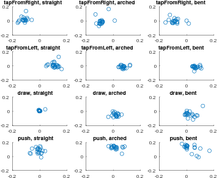

# hand-posture-affordances

This dataset contains results of trials in which the robot executes different actions with multiple hand postures on various objects. Below we show the experimental setup, with the iCub humanoid robot at the beginning of a robot–object interaction trial, and the visual perception routines in the background screen.

## Dataset Description

In the current version of this data, we consider 4 motor actions A (tapFromRight, tapFromLeft, draw, push), 2 objects O (lego piece, pear), and 3 hand postures H (straight fingers, arched fingers, bent fingers). We extract visual features from both O and H. Below is the distribution of the motion effects onto target objects caused by the robot influence when it touches objects with its hand manipulator:

Each subplot displays the geometrical displacement along horizontal and vertical direction (in meters, measured from the object initial position) from the point of view of the robot (the robot is at the "0" along the x-axis marker). For example, tapping an object from the right (tapFromRight action) usually results in making the object shift to the left direction; drawing (i.e., pulling) an object closer only works if the manipulator morphology is appropriate.

## Documentation

The dataset is contained in the following file:
- **affData**, contains approximately 42k hand affordance experiments in the format H O A E, where H is a 12-dimensional shape features vector of the hand, O is a 12-dimensional shape features vector of the object, A is the discrete index of the action (1 tapFromRight, 2 tapFromLeft, 3 draw, 4 push), E is a 2-dimensional vector of the effects (measured along X and Y in the iCub robot's 3D reference frame)

In addition, we also provide these files:
- **all_desc**, contains the 13 shape descriptors extracted from the robot hand postures from various viewpoints (convexityDefects was not used)
- **all_effs**, contains the geometric effect displacement of the objects (initial and final 2D and 3D)
- **cont_desc_noheader**, H and O data in purely numerical format
- **cont_eff_noheader**, similar to **all_effs** but with fields in numerical format
- **hands_2017-03-27**, H seen from different viewpoints, shape descriptors. Also includes the joints configuration of the robot arm and head during the CAD hand imagination
- **objects_2017-03-27**, O seen from different viewpoints, shape descriptors
- **tool\***, baseline tool use dataset taken from the paper A Moderately Large Size Dataset to Learn Visual Affordances of Objects and Tools Using iCub Humanoid Robot

## Citation

If you use this dataset in your work, please cite the following publication(s):

* Giovanni Saponaro, Pedro Vicente, Atabak Dehban, Lorenzo Jamone, Alexandre Bernardino, José Santos-Victor. Learning at the Ends: From Hand to Tool Affordances in Humanoid Robots. IEEE International Conference on Development and Learning and on Epigenetic Robotics (ICDL-EpiRob 2017).

For more information, please contact gsaponaro at isr dot tecnico dot ulisboa dot pt.
