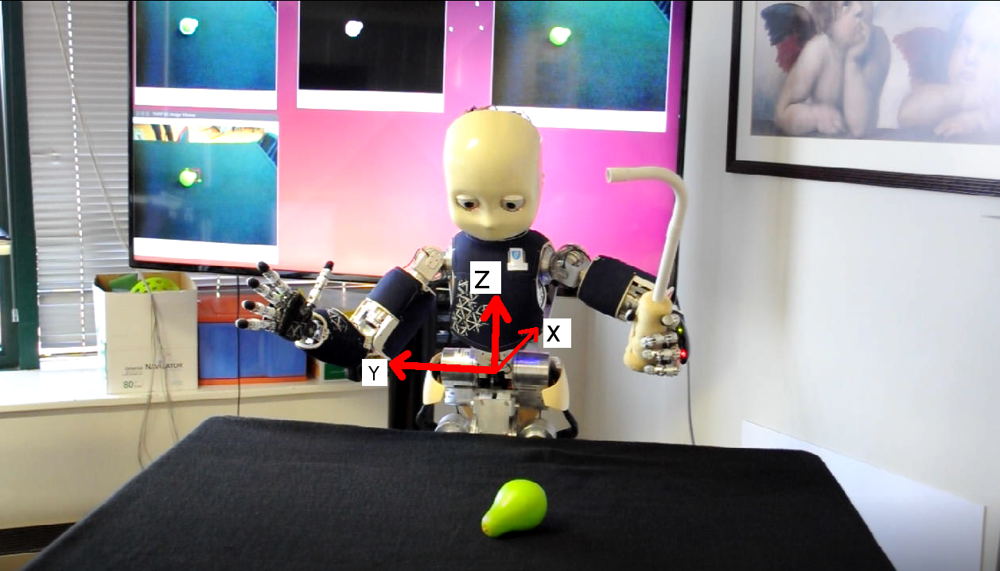

# visual-affordances-of-objects-and-tools

This dataset contains results of trials in which the robot executes different actions with multiple tools on various objects. Below we show the experimental setup, with the iCub humanoid robot at the beginning of a robot--object interaction trial, the reference frame annotation, and the visual perception routines in the background screen.

In total, there are 11 objects, 4 actions, 3 tools and at least 10 repetitions of each trial, which sums up to ~1320 unique trials and 5280 unique images of resolution 320×200 pixels. The images are captured from left and right cameras of the robot before and after executing a successful action. We also provide the foreground segmented images of each trial. Moreover, the 3D position of the object together with some extracted features are also available. For more information, please contact adehban at isr dot tecnico dot ulisboa dot pt.

If you use this dataset in your work, please cite the following publication(s):

* Towards learning deep features for multi-modal inference with robotic data. A. Dehban, G. Saponaro, S. Zhang, L. Jamone, A. R. Kampff, J. and Santos-Victor. (2017). International Journal of Robotics Research.

* A Moderately Large Size Dataset to Learn Visual Affordances of Objects and Tools Using iCub Humanoid Robot. A. Dehban, L. Jamone, A. R. Kampff, J. Santos-Victor. (2016). 1st Workshop on Action and Anticipation for Visual Learning, European Conference on Computer Vision (ECCV).
